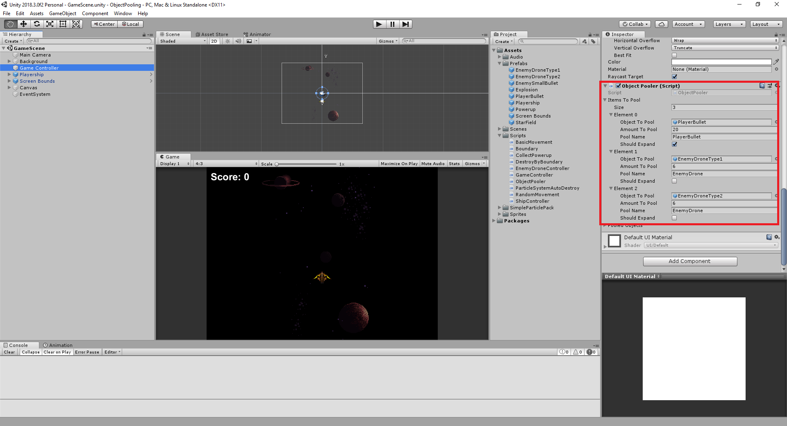

# Object Pooling

## Overview

A place to demo object pooling pattern to know how it's helpful for performance.

Unity uses Garbage Collection to deallocate memory that’s no longer in use. Repeated calls to Destroy() frequently trigger this task, and it has a knack for slowing down CPUs and introducing pauses to gameplay.

## Features:

In this Unity tutorial, you’ll know:

* All about object pooling
* How to pool a game object
* How to expand your object pool at runtime if necessary
* How to extend your object pool to accommodate different objects

All things, you can find in ObjectPooler script:
